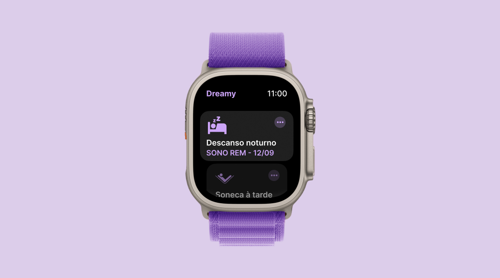

<h1 align="center"> App de Sono para Smartwatch </h1>

O App de Sono para Smartwatch é uma página web que simula um smartwatch exibindo um histórico de sono, incluindo tipo de sono e data. Foi uma excelente oportunidade para reforçar conceitos e aprender novas técnicas.

  <a href="#-tecnologias">Tecnologias</a>&nbsp;&nbsp;&nbsp;|&nbsp;&nbsp;&nbsp;
  <a href="#-projeto">Projeto</a>&nbsp;&nbsp;&nbsp;|&nbsp;&nbsp;&nbsp;
  <a href="#-destaques do aprendizado">Destaques do Aprendizado</a>&nbsp;&nbsp;&nbsp;|&nbsp;&nbsp;&nbsp;
  <a href="#memo-licença">Licença</a>
 

 

  

## 🚀 Tecnologias

Esse projeto foi desenvolvido com as seguintes tecnologias:

- HTML e CSS
- JavaScript
- Git e Github
- Figma.
- Swiperjs.

## 💻 Projeto

O App de Sono para Smartwatch é uma página web que simula um smartwatch exibindo um histórico de sono, incluindo tipo de sono e data.

- [Acesse o projeto finalizado, online](https://juandasilvaa.github.io//)

## 🔍 Destaques do Aprendizado

- Conhecer e aprender a trabalhar com a lib Swiperjs:
  Swiperjs é uma biblioteca de carrossel para containers, imagens, dentre outras coisas que podem ser adaptadas de várias maneiras.
- Entender melhor a documentação da lib e fazer modificações minhas: Foi uma ótima experiência para aprofundar meu conhecimento na leitura de documentação e implementar minhas próprias modificações.

## 📝 Licença

Este projeto faz parte do #boraCodar da Rocketseat, onde eles fornecem um design no Figma e você deve desenvolver. Para acessar a resolução da forma deles, é necessário ser assinante., [clique aqui](https://www.rocketseat.com.br/boracodar/desafios-anteriores/um-app-de-sono-para-smartwatch-desafio-37).
